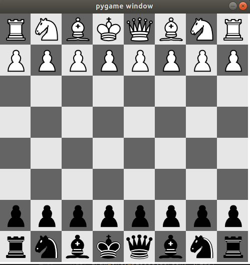

## Chess Game.

The board of the game created using `pygame`.

## Chess Engine through reinforcement Learning.
Chess and Learning how to play throught reinforcement learning.

an other chess engine is used to train ours.

 